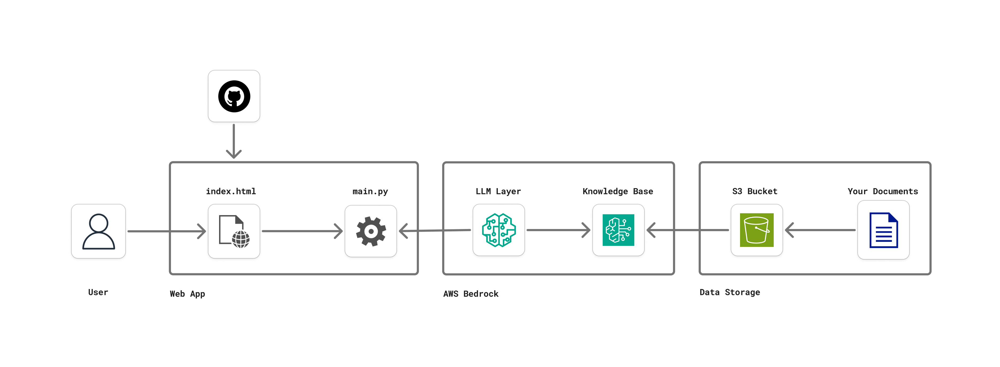

# AWS Bedrock RAG Chatbot

A modern **AWS Bedrock-based** Retrieval-Augmented Generation (RAG) web application that provides an intelligent chatbot interface for querying documents and general AI conversations.

## 🏗️ Architecture Overview



### 🎥 Demo Video
Watch the application in action:

https://github.com/user-attachments/assets/74743076-0cb1-4f2c-beb1-abc9fd3337f2

This application leverages **AWS Bedrock** services to provide two distinct AI interaction modes:

- **Knowledge Base Mode**: Uses AWS Bedrock Knowledge Base with retrieval-augmented generation for document-specific queries
- **Direct AI Mode**: Direct interaction with AWS Bedrock's Llama 3 model for general conversations

## 🚀 Key Features

- **Dual AI Interaction Modes**
  - Knowledge Base RAG: Query specific document collections and knowledge bases
  - Direct AI Chat: General-purpose AI conversations using Llama 3
- **Modern Web Interface**: Clean, responsive design with dark theme
- **Real-time Chat**: Interactive chat interface with typing indicators
- **Document Intelligence**: AI-powered document querying and analysis
- **AWS Integration**: Full integration with AWS Bedrock services

## 🛠️ Technology Stack

### Backend
- **FastAPI**: High-performance Python web framework
- **AWS Bedrock**: AI/ML services for model inference and knowledge base
- **AWS Bedrock Agent Runtime**: For knowledge base retrieval and generation
- **Boto3**: AWS SDK for Python integration
- **Uvicorn**: ASGI server for FastAPI

### Frontend
- **HTML5/CSS3**: Modern responsive web interface
- **Vanilla JavaScript**: Client-side interactivity
- **Jinja2**: Server-side templating

### AWS Services
- **AWS Bedrock Runtime**: Direct model invocation
- **AWS Bedrock Agent Runtime**: Knowledge base operations
- **AWS Bedrock Knowledge Base**: Document retrieval system

## 📋 Prerequisites

- Python 3.8+
- AWS Account with Bedrock access
- AWS CLI configured with appropriate permissions
- Virtual environment (recommended)

## 🔧 Installation

1. **Clone the repository**
   ```bash
   git clone <repository-url>
   cd nextwork-rag-webapp
   ```

2. **Create and activate virtual environment**
   ```bash
   python -m venv venv
   source venv/bin/activate  # On Windows: venv\Scripts\activate
   ```

3. **Install dependencies**
   ```bash
   pip install -r requirements.txt
   ```

4. **Configure environment variables**
   Create a `.env` file in the root directory:
   ```env
   AWS_REGION=us-east-2
   MODEL_ID=meta.llama3-70b-instruct-v1:0
   KNOWLEDGE_BASE_ID=your_knowledge_base_id
   MODEL_ARN=arn:aws:bedrock:us-east-2::foundation-model/meta.llama3-70b-instruct-v1:0
   ```

## 🚀 Running the Application

### Option 1: Using the main FastAPI app
```bash
python -m uvicorn main:app --reload --host 127.0.0.1 --port 8000
```

### Option 2: Using the web application
```bash
python -m uvicorn web_app:app --reload --host 127.0.0.1 --port 8000
```

### Option 3: Direct execution
```bash
python web_app.py
```

The application will be available at `http://127.0.0.1:8000`

## 🔌 API Endpoints

### Knowledge Base Query
```
GET /bedrock/query?text=your_question_here
```
Queries the AWS Bedrock Knowledge Base for document-specific information.

**Example:**
```
http://127.0.0.1:8000/bedrock/query?text=what%20are%20Warren%20Buffett%27s%20main%20investment%20principles?
```

**More Warren Buffett RAG Examples:**
```
http://127.0.0.1:8000/bedrock/query?text=what%20is%20the%20margin%20of%20safety%20concept?
http://127.0.0.1:8000/bedrock/query?text=how%20does%20Buffett%20evaluate%20management%20quality?
http://127.0.0.1:8000/bedrock/query?text=what%20are%20the%20business%20tenets%20for%20investing?
```

### Direct Model Invocation
```
GET /bedrock/invoke?text=your_question_here
```
Directly invokes the Llama 3 model for general AI conversations.

**Example:**
```
http://127.0.0.1:8000/bedrock/invoke?text=explain%20artificial%20intelligence
```

## 🏛️ Application Structure

```
aws-bedrock-rag-webapp/
├── main.py              # Simple FastAPI app with knowledge base endpoint
├── web_app.py           # Full web application with UI
├── requirements.txt     # Python dependencies
├── architecture/
│   ├── image.png       # Architecture diagram
│   └── open-source-rag-chatbot-1756584527454.mp4  # Demo video
├── templates/
│   └── index.html      # Main web interface
├── static/
│   └── style.css       # Application styles
└── venv/               # Virtual environment
```

## ⚙️ Configuration

### AWS Bedrock Setup

1. **Enable AWS Bedrock**: Ensure Bedrock is available in your AWS region
2. **Model Access**: Request access to Llama 3 models in AWS Bedrock console
3. **Knowledge Base**: Create and configure a Bedrock Knowledge Base with your documents
4. **IAM Permissions**: Ensure your AWS credentials have the following permissions:
   - `bedrock:InvokeModel`
   - `bedrock:RetrieveAndGenerate`
   - `bedrock-agent:RetrieveAndGenerate`

### Environment Variables

| Variable | Description | Example |
|----------|-------------|---------|
| `AWS_REGION` | AWS region for Bedrock services | `us-east-2` |
| `MODEL_ID` | Bedrock model identifier | `meta.llama3-70b-instruct-v1:0` |
| `KNOWLEDGE_BASE_ID` | Your Bedrock Knowledge Base ID | `ABC123DEF456` |
| `MODEL_ARN` | Full ARN of the Bedrock model | `arn:aws:bedrock:...` |

## 🎯 Use Cases

- **Document Analysis**: Intelligent querying of document collections
- **Interactive Documentation**: Query documentation through natural language
- **Knowledge Management**: AI-powered information retrieval from knowledge bases
- **Investment Research**: Query investment strategies and principles (demo includes Warren Buffett's investment philosophy)
- **General AI Chat**: Use for broader technical discussions and assistance

### 📚 Sample Knowledge Base
This demo includes **"The Warren Buffett Way"** by Robert G. Hagstrom as the sample document for testing RAG capabilities. The knowledge base contains Warren Buffett's investment strategies, business principles, and financial wisdom.

**Source Document**: [The Warren Buffett Way PDF](https://www.idbidirect.in/idbiadmin/pdf/The-Warren-Buffett-Way.pdf)

## 🔍 Features Deep Dive

### Knowledge Base RAG Mode
- Retrieves relevant information from indexed document collections
- Provides context-aware responses based on actual document content
- Ideal for specific questions about stored information and documentation

### Direct AI Mode
- Direct access to Llama 3 model capabilities
- General-purpose conversational AI
- Useful for broader technical discussions and explanations

### Web Interface
- **Clean Chat Interface**: Streamlined chatbot interface with mode toggle
- **Responsive Design**: Works on desktop and mobile devices
- **Real-time Feedback**: Typing indicators and smooth interactions

## 🚨 Error Handling

The application includes comprehensive error handling for:
- AWS service errors (ClientError, BotoCoreError)
- Missing environment variables
- Model invocation failures
- Network connectivity issues

## 📱 Responsive Design

The application is fully responsive and optimized for:
- Desktop browsers
- Tablet devices
- Mobile phones

## 🤝 Contributing

1. Fork the repository
2. Create a feature branch
3. Make your changes
4. Test thoroughly
5. Submit a pull request

## 📄 License

This project is open source. Please refer to the license file for usage guidelines.

## 🔗 Related Links

- [AWS Bedrock Documentation](https://docs.aws.amazon.com/bedrock/)
- [FastAPI Documentation](https://fastapi.tiangolo.com/)
- [Boto3 Documentation](https://boto3.amazonaws.com/v1/documentation/api/latest/index.html)

---

**Built with ❤️ using AWS Bedrock and FastAPI**
